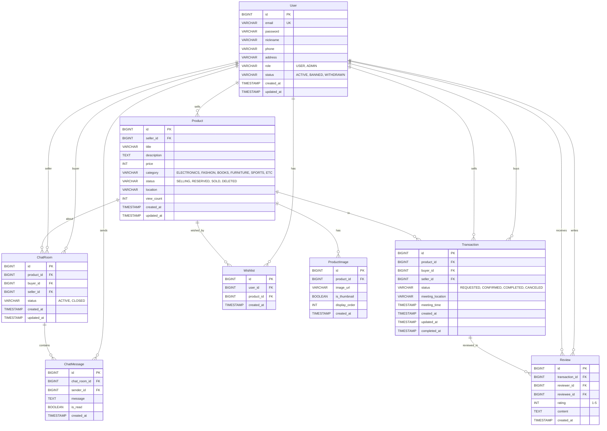

# ERD 문서 - 중고 거래 플랫폼

## 개요

이 문서는 중고 거래 플랫폼의 데이터베이스 구조를 정의합니다. 총 8개의 테이블로 구성되어 있으며, 사용자 관리, 상품 관리, 거래, 채팅, 리뷰, 찜 기능을 지원합니다.

---

## 테이블 정의

### 1. User (사용자)

사용자 정보를 관리하는 테이블입니다.

| 컬럼명 | 데이터 타입 | 제약 조건 | 설명 |
|--------|------------|----------|------|
| id | BIGINT | PK, AUTO_INCREMENT | 사용자 고유 ID |
| email | VARCHAR(255) | UNIQUE, NOT NULL | 이메일 (로그인 ID) |
| password | VARCHAR(255) | NOT NULL | 암호화된 비밀번호 |
| nickname | VARCHAR(50) | NOT NULL | 사용자 닉네임 |
| phone | VARCHAR(20) | | 연락처 |
| address | VARCHAR(255) | | 주소 |
| role | VARCHAR(20) | DEFAULT: USER | 사용자 역할 (USER, ADMIN) |
| status | VARCHAR(20) | DEFAULT: ACTIVE | 계정 상태 (ACTIVE, BANNED, WITHDRAWN) |
| created_at | TIMESTAMP | DEFAULT: CURRENT_TIMESTAMP | 생성 일시 |
| updated_at | TIMESTAMP | DEFAULT: CURRENT_TIMESTAMP ON UPDATE CURRENT_TIMESTAMP | 수정 일시 |

**ENUM 값:**
- role: `USER`, `ADMIN`
- status: `ACTIVE`, `BANNED`, `WITHDRAWN`

---

### 2. Product (상품)

판매 상품 정보를 관리하는 테이블입니다.

| 컬럼명 | 데이터 타입 | 제약 조건 | 설명 |
|--------|------------|----------|------|
| id | BIGINT | PK, AUTO_INCREMENT | 상품 고유 ID |
| seller_id | BIGINT | FK → User.id, NOT NULL | 판매자 ID |
| title | VARCHAR(255) | NOT NULL | 상품 제목 |
| description | TEXT | | 상품 설명 |
| price | INT | NOT NULL | 가격 (원) |
| category | VARCHAR(50) | | 카테고리 |
| status | VARCHAR(20) | DEFAULT: SELLING | 상품 상태 |
| location | VARCHAR(255) | | 거래 희망 장소 |
| view_count | INT | DEFAULT: 0 | 조회수 |
| created_at | TIMESTAMP | DEFAULT: CURRENT_TIMESTAMP | 등록 일시 |
| updated_at | TIMESTAMP | DEFAULT: CURRENT_TIMESTAMP ON UPDATE CURRENT_TIMESTAMP | 수정 일시 |

**ENUM 값:**
- category: `ELECTRONICS`, `FASHION`, `BOOKS`, `FURNITURE`, `SPORTS`, `ETC`
- status: `SELLING`, `RESERVED`, `SOLD`, `DELETED`

**상태 전이 규칙:**
```
SELLING → RESERVED  (구매 요청 수락 시)
RESERVED → SOLD     (거래 완료 시)
RESERVED → SELLING  (구매 취소 시)
ANY → DELETED       (삭제 시)
```

**인덱스:**
- `idx_seller_id` on seller_id
- `idx_status` on status
- `idx_category` on category
- `idx_created_at` on created_at

---

### 3. ProductImage (상품 이미지)

상품에 첨부된 이미지를 관리하는 테이블입니다.

| 컬럼명 | 데이터 타입 | 제약 조건 | 설명 |
|--------|------------|----------|------|
| id | BIGINT | PK, AUTO_INCREMENT | 이미지 고유 ID |
| product_id | BIGINT | FK → Product.id, NOT NULL, ON DELETE CASCADE | 상품 ID |
| image_url | VARCHAR(500) | NOT NULL | 이미지 URL |
| is_thumbnail | BOOLEAN | DEFAULT: false | 썸네일 여부 |
| display_order | INT | DEFAULT: 0 | 표시 순서 |
| created_at | TIMESTAMP | DEFAULT: CURRENT_TIMESTAMP | 등록 일시 |

**비즈니스 규칙:**
- 상품당 최대 10개의 이미지
- is_thumbnail = true인 이미지는 상품당 1개만 존재

**인덱스:**
- `idx_product_id` on product_id

---

### 4. Transaction (거래)

구매자와 판매자 간의 거래 정보를 관리하는 테이블입니다.

| 컬럼명 | 데이터 타입 | 제약 조건 | 설명 |
|--------|------------|----------|------|
| id | BIGINT | PK, AUTO_INCREMENT | 거래 고유 ID |
| product_id | BIGINT | FK → Product.id, NOT NULL | 상품 ID |
| buyer_id | BIGINT | FK → User.id, NOT NULL | 구매자 ID |
| seller_id | BIGINT | FK → User.id, NOT NULL | 판매자 ID |
| status | VARCHAR(20) | DEFAULT: REQUESTED | 거래 상태 |
| meeting_location | VARCHAR(255) | | 만남 장소 |
| meeting_time | TIMESTAMP | | 만남 시간 |
| created_at | TIMESTAMP | DEFAULT: CURRENT_TIMESTAMP | 생성 일시 |
| updated_at | TIMESTAMP | DEFAULT: CURRENT_TIMESTAMP ON UPDATE CURRENT_TIMESTAMP | 수정 일시 |
| completed_at | TIMESTAMP | | 완료 일시 |

**ENUM 값:**
- status: `REQUESTED`, `CONFIRMED`, `COMPLETED`, `CANCELED`

**상태 전이 규칙:**
```
REQUESTED → CONFIRMED  (판매자 수락)
REQUESTED → CANCELED   (구매자/판매자 취소)
CONFIRMED → COMPLETED  (거래 완료)
CONFIRMED → CANCELED   (특정 조건에서 취소 가능)
```

**비즈니스 규칙:**
- `buyer_id ≠ seller_id` (자기 자신에게 구매 요청 불가)
- product.status가 `SELLING`일 때만 거래 생성 가능
- 거래 생성 시 product.status를 `RESERVED`로 변경
- 동시에 여러 거래 요청이 들어올 경우 1개만 성공 (동시성 제어 필요)
- 거래가 `CANCELED` 또는 `COMPLETED`로 변경 시 연관된 product.status 업데이트

**인덱스:**
- `idx_product_id` on product_id
- `idx_buyer_id` on buyer_id
- `idx_seller_id` on seller_id

---

### 5. ChatRoom (채팅방)

상품에 대한 구매자와 판매자 간의 채팅방을 관리하는 테이블입니다.

| 컬럼명 | 데이터 타입 | 제약 조건 | 설명 |
|--------|------------|----------|------|
| id | BIGINT | PK, AUTO_INCREMENT | 채팅방 고유 ID |
| product_id | BIGINT | FK → Product.id, NOT NULL | 상품 ID |
| buyer_id | BIGINT | FK → User.id, NOT NULL | 구매자 ID |
| seller_id | BIGINT | FK → User.id, NOT NULL | 판매자 ID |
| status | VARCHAR(20) | DEFAULT: ACTIVE | 채팅방 상태 |
| created_at | TIMESTAMP | DEFAULT: CURRENT_TIMESTAMP | 생성 일시 |
| updated_at | TIMESTAMP | DEFAULT: CURRENT_TIMESTAMP ON UPDATE CURRENT_TIMESTAMP | 최종 메시지 일시 |

**ENUM 값:**
- status: `ACTIVE`, `CLOSED`

**비즈니스 규칙:**
- `UNIQUE(product_id, buyer_id)` - 같은 상품에 같은 구매자는 1개의 채팅방만 생성 가능

**인덱스:**
- `idx_product_buyer` on (product_id, buyer_id) UNIQUE
- `idx_buyer_id` on buyer_id
- `idx_seller_id` on seller_id

---

### 6. ChatMessage (채팅 메시지)

채팅방 내의 메시지를 관리하는 테이블입니다.

| 컬럼명 | 데이터 타입 | 제약 조건 | 설명 |
|--------|------------|----------|------|
| id | BIGINT | PK, AUTO_INCREMENT | 메시지 고유 ID |
| chat_room_id | BIGINT | FK → ChatRoom.id, NOT NULL, ON DELETE CASCADE | 채팅방 ID |
| sender_id | BIGINT | FK → User.id, NOT NULL | 발신자 ID |
| message | TEXT | NOT NULL | 메시지 내용 |
| is_read | BOOLEAN | DEFAULT: false | 읽음 여부 |
| created_at | TIMESTAMP | DEFAULT: CURRENT_TIMESTAMP | 전송 일시 |

**비즈니스 규칙:**
- sender_id는 해당 채팅방의 buyer_id 또는 seller_id여야 함

**인덱스:**
- `idx_chat_room_id` on chat_room_id
- `idx_created_at` on created_at

---

### 7. Review (리뷰)

거래 완료 후 상대방에 대한 리뷰를 관리하는 테이블입니다.

| 컬럼명 | 데이터 타입 | 제약 조건 | 설명 |
|--------|------------|----------|------|
| id | BIGINT | PK, AUTO_INCREMENT | 리뷰 고유 ID |
| transaction_id | BIGINT | FK → Transaction.id, NOT NULL | 거래 ID |
| reviewer_id | BIGINT | FK → User.id, NOT NULL | 리뷰 작성자 ID |
| reviewee_id | BIGINT | FK → User.id, NOT NULL | 리뷰 대상자 ID |
| rating | INT | NOT NULL, CHECK(rating >= 1 AND rating <= 5) | 평점 (1~5) |
| content | TEXT | | 리뷰 내용 |
| created_at | TIMESTAMP | DEFAULT: CURRENT_TIMESTAMP | 작성 일시 |

**비즈니스 규칙:**
- transaction.status가 `COMPLETED`일 때만 리뷰 작성 가능
- reviewer_id는 transaction의 buyer_id 또는 seller_id여야 함
- reviewee_id는 transaction의 상대방이어야 함 (buyer ↔ seller)
- `UNIQUE(transaction_id, reviewer_id)` - 한 거래당 각 참여자는 1개의 리뷰만 작성 가능

**인덱스:**
- `idx_transaction_reviewer` on (transaction_id, reviewer_id) UNIQUE
- `idx_reviewee_id` on reviewee_id

---

### 8. Wishlist (찜)

사용자가 관심 있는 상품을 저장하는 테이블입니다.

| 컬럼명 | 데이터 타입 | 제약 조건 | 설명 |
|--------|------------|----------|------|
| id | BIGINT | PK, AUTO_INCREMENT | 찜 고유 ID |
| user_id | BIGINT | FK → User.id, NOT NULL, ON DELETE CASCADE | 사용자 ID |
| product_id | BIGINT | FK → Product.id, NOT NULL, ON DELETE CASCADE | 상품 ID |
| created_at | TIMESTAMP | DEFAULT: CURRENT_TIMESTAMP | 찜한 일시 |

**비즈니스 규칙:**
- `UNIQUE(user_id, product_id)` - 중복 찜 방지

**인덱스:**
- `idx_user_product` on (user_id, product_id) UNIQUE
- `idx_product_id` on product_id

---

## 관계 정의 (Relationships)

### User 관련 관계
- User (1) : (N) Product - seller_id
  - 한 사용자는 여러 상품을 판매할 수 있음
  
- User (1) : (N) Transaction - buyer_id
  - 한 사용자는 여러 거래의 구매자가 될 수 있음
  
- User (1) : (N) Transaction - seller_id
  - 한 사용자는 여러 거래의 판매자가 될 수 있음
  
- User (1) : (N) ChatRoom - buyer_id
  - 한 사용자는 여러 채팅방의 구매자가 될 수 있음
  
- User (1) : (N) ChatRoom - seller_id
  - 한 사용자는 여러 채팅방의 판매자가 될 수 있음
  
- User (1) : (N) ChatMessage - sender_id
  - 한 사용자는 여러 메시지를 전송할 수 있음
  
- User (1) : (N) Review - reviewer_id
  - 한 사용자는 여러 리뷰를 작성할 수 있음
  
- User (1) : (N) Review - reviewee_id
  - 한 사용자는 여러 리뷰를 받을 수 있음
  
- User (1) : (N) Wishlist
  - 한 사용자는 여러 상품을 찜할 수 있음

### Product 관련 관계
- Product (1) : (N) ProductImage
  - 한 상품은 여러 이미지를 가질 수 있음
  
- Product (1) : (N) Transaction
  - 한 상품은 여러 거래 요청을 받을 수 있음 (단, 최종적으로 1개만 COMPLETED)
  
- Product (1) : (N) ChatRoom
  - 한 상품에 대해 여러 채팅방이 생성될 수 있음
  
- Product (1) : (N) Wishlist
  - 한 상품은 여러 사용자에게 찜될 수 있음

### ChatRoom 관련 관계
- ChatRoom (1) : (N) ChatMessage
  - 한 채팅방은 여러 메시지를 포함함

### Transaction 관련 관계
- Transaction (1) : (N) Review
  - 한 거래는 최대 2개의 리뷰를 가질 수 있음 (구매자 리뷰 1개, 판매자 리뷰 1개)

---

## ERD 다이어그램 (Mermaid)



---

## 핵심 비즈니스 규칙

### 1. 상품 상태 관리
- 상품은 `SELLING` → `RESERVED` → `SOLD` 순서로 상태가 전이됨
- 거래 취소 시 `RESERVED` → `SELLING`으로 복귀
- 언제든 `DELETED` 상태로 전환 가능 (논리적 삭제)

### 2. 거래 프로세스
1. 구매자가 `SELLING` 상태의 상품에 거래 요청 (`REQUESTED`)
2. 판매자가 수락하면 거래 상태 `CONFIRMED`, 상품 상태 `RESERVED`
3. 거래 완료 시 거래 상태 `COMPLETED`, 상품 상태 `SOLD`
4. 거래 취소 시 거래 상태 `CANCELED`, 상품 상태 `SELLING`으로 복귀

### 3. 동시성 제어
- **문제**: 동일 상품에 여러 구매자가 동시에 거래 요청
- **해결**: 낙관적 락(Optimistic Lock) 사용
  - Product 테이블에 version 컬럼 추가
  - 거래 생성 시 상품 상태 변경과 함께 version 체크
  - 먼저 성공한 거래만 CONFIRMED, 나머지는 실패 처리

### 4. 데이터 무결성
- **외래 키 제약**: 모든 관계에 FK 설정
- **Cascade 삭제**: 
  - ProductImage: 상품 삭제 시 이미지도 삭제
  - ChatMessage: 채팅방 삭제 시 메시지도 삭제
  - Wishlist: 사용자 또는 상품 삭제 시 찜 정보 삭제
- **Unique 제약**:
  - (product_id, buyer_id) in ChatRoom
  - (transaction_id, reviewer_id) in Review
  - (user_id, product_id) in Wishlist

### 5. 권한 관리
- **USER**: 일반 사용자, 상품 등록/구매/채팅/리뷰 작성
- **ADMIN**: 관리자, 모든 데이터 조회/관리, 사용자 정지 권한

### 6. 리뷰 시스템
- 거래가 `COMPLETED` 상태일 때만 리뷰 작성 가능
- 구매자와 판매자 각각 1개씩 리뷰 작성 가능 (총 2개)
- 평점은 1~5점 사이만 허용

### 7. 채팅 시스템
- 상품당 구매자별로 1개의 채팅방만 생성
- 채팅방은 구매자가 생성하며, 판매자는 자동으로 참여
- 메시지 읽음 처리를 통한 알림 기능 지원

---

## 확장 고려사항

### 성능 최적화
- 조회 성능을 위한 인덱스 추가
- 상품 목록 조회 시 페이징 처리
- 채팅 메시지 페이징 및 캐싱

### 추가 기능
- 신고(Report) 테이블 추가 가능
- 알림(Notification) 테이블 추가 가능
- 상품 검색을 위한 전문 검색 엔진 연동
- 이미지 업로드를 위한 파일 저장소 연동

### 보안
- 비밀번호 암호화 (BCrypt)
- JWT 기반 인증/인가
- SQL Injection 방지 (JPA 사용)
- XSS 방지

---

## 참고사항

이 ERD는 Spring Boot + JPA를 기반으로 구현될 예정이며, 각 테이블은 JPA Entity로 매핑됩니다. 상태 전이 규칙과 비즈니스 로직은 Service 계층에서 구현되며, 동시성 제어는 JPA의 `@Version` 어노테이션을 활용한 낙관적 락으로 처리됩니다.
