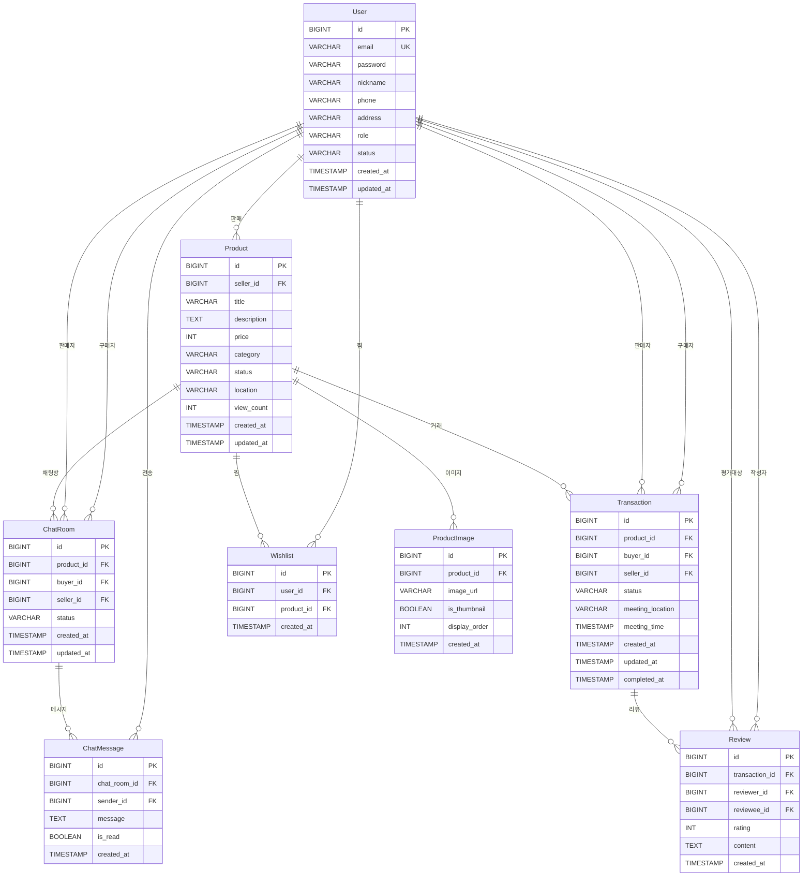

# 중고 거래 플랫폼 ERD

## 목차
1. [개요](#개요)
2. [ERD 다이어그램](#erd-다이어그램)
3. [테이블 정의](#테이블-정의)
4. [관계 정의](#관계-정의)
5. [비즈니스 규칙](#비즈니스-규칙)

## 개요
중고 거래 플랫폼의 데이터베이스 설계 문서입니다.

## ERD 다이어그램

## 테이블 정의

### 1. User (사용자)
- id: BIGINT (PK, AUTO_INCREMENT)
- email: VARCHAR(255) (UNIQUE, NOT NULL)
- password: VARCHAR(255) (NOT NULL)
- nickname: VARCHAR(50) (NOT NULL)
- phone: VARCHAR(20)
- address: VARCHAR(255)
- role: VARCHAR(20) (ENUM: USER, ADMIN) DEFAULT 'USER'
- status: VARCHAR(20) (ENUM: ACTIVE, BANNED, WITHDRAWN) DEFAULT 'ACTIVE'
- created_at: TIMESTAMP DEFAULT CURRENT_TIMESTAMP
- updated_at: TIMESTAMP DEFAULT CURRENT_TIMESTAMP ON UPDATE CURRENT_TIMESTAMP

### 2. Product (상품)
- id: BIGINT (PK, AUTO_INCREMENT)
- seller_id: BIGINT (FK → User.id, NOT NULL)
- title: VARCHAR(255) (NOT NULL)
- description: TEXT
- price: INT (NOT NULL)
- category: VARCHAR(50) (ENUM: ELECTRONICS, FASHION, BOOKS, FURNITURE, SPORTS, ETC)
- status: VARCHAR(20) (ENUM: SELLING, RESERVED, SOLD, DELETED) DEFAULT 'SELLING'
- location: VARCHAR(255)
- view_count: INT DEFAULT 0
- created_at: TIMESTAMP DEFAULT CURRENT_TIMESTAMP
- updated_at: TIMESTAMP DEFAULT CURRENT_TIMESTAMP ON UPDATE CURRENT_TIMESTAMP

**상태 전이:**
- SELLING → RESERVED (구매 요청 수락)
- RESERVED → SOLD (거래 완료)
- RESERVED → SELLING (구매 취소)
- ANY → DELETED (삭제)

### 3. ProductImage (상품 이미지)
- id: BIGINT (PK, AUTO_INCREMENT)
- product_id: BIGINT (FK → Product.id, NOT NULL, ON DELETE CASCADE)
- image_url: VARCHAR(500) (NOT NULL)
- is_thumbnail: BOOLEAN DEFAULT false
- display_order: INT DEFAULT 0
- created_at: TIMESTAMP DEFAULT CURRENT_TIMESTAMP

### 4. Transaction (거래)
- id: BIGINT (PK, AUTO_INCREMENT)
- product_id: BIGINT (FK → Product.id, NOT NULL)
- buyer_id: BIGINT (FK → User.id, NOT NULL)
- seller_id: BIGINT (FK → User.id, NOT NULL)
- status: VARCHAR(20) (ENUM: REQUESTED, CONFIRMED, COMPLETED, CANCELED) DEFAULT 'REQUESTED'
- meeting_location: VARCHAR(255)
- meeting_time: TIMESTAMP
- created_at: TIMESTAMP DEFAULT CURRENT_TIMESTAMP
- updated_at: TIMESTAMP DEFAULT CURRENT_TIMESTAMP ON UPDATE CURRENT_TIMESTAMP
- completed_at: TIMESTAMP

**상태 전이:**
- REQUESTED → CONFIRMED (판매자 수락)
- REQUESTED → CANCELED (취소)
- CONFIRMED → COMPLETED (거래 완료)
- CONFIRMED → CANCELED (특정 조건 하 취소)

**제약 조건:**
- CHECK (buyer_id != seller_id)

### 5. ChatRoom (채팅방)
- id: BIGINT (PK, AUTO_INCREMENT)
- product_id: BIGINT (FK → Product.id, NOT NULL)
- buyer_id: BIGINT (FK → User.id, NOT NULL)
- seller_id: BIGINT (FK → User.id, NOT NULL)
- status: VARCHAR(20) (ENUM: ACTIVE, CLOSED) DEFAULT 'ACTIVE'
- created_at: TIMESTAMP DEFAULT CURRENT_TIMESTAMP
- updated_at: TIMESTAMP DEFAULT CURRENT_TIMESTAMP ON UPDATE CURRENT_TIMESTAMP

**제약 조건:**
- UNIQUE (product_id, buyer_id)

### 6. ChatMessage (채팅 메시지)
- id: BIGINT (PK, AUTO_INCREMENT)
- chat_room_id: BIGINT (FK → ChatRoom.id, NOT NULL, ON DELETE CASCADE)
- sender_id: BIGINT (FK → User.id, NOT NULL)
- message: TEXT (NOT NULL)
- is_read: BOOLEAN DEFAULT false
- created_at: TIMESTAMP DEFAULT CURRENT_TIMESTAMP

### 7. Review (리뷰)
- id: BIGINT (PK, AUTO_INCREMENT)
- transaction_id: BIGINT (FK → Transaction.id, NOT NULL)
- reviewer_id: BIGINT (FK → User.id, NOT NULL)
- reviewee_id: BIGINT (FK → User.id, NOT NULL)
- rating: INT (NOT NULL, CHECK: rating BETWEEN 1 AND 5)
- content: TEXT
- created_at: TIMESTAMP DEFAULT CURRENT_TIMESTAMP

**제약 조건:**
- UNIQUE (transaction_id, reviewer_id)

### 8. Wishlist (찜)
- id: BIGINT (PK, AUTO_INCREMENT)
- user_id: BIGINT (FK → User.id, NOT NULL, ON DELETE CASCADE)
- product_id: BIGINT (FK → Product.id, NOT NULL, ON DELETE CASCADE)
- created_at: TIMESTAMP DEFAULT CURRENT_TIMESTAMP

**제약 조건:**
- UNIQUE (user_id, product_id)

## 관계 정의
- User 1:N Product (seller_id)
- User 1:N Transaction (buyer_id, seller_id)
- User 1:N ChatRoom (buyer_id, seller_id)
- User 1:N ChatMessage (sender_id)
- User 1:N Review (reviewer_id, reviewee_id)
- User 1:N Wishlist
- Product 1:N ProductImage
- Product 1:N Transaction
- Product 1:N ChatRoom
- Product 1:N Wishlist
- ChatRoom 1:N ChatMessage
- Transaction 1:N Review

## 비즈니스 규칙

### 상품 상태 관리
- 판매중(SELLING) 상품만 구매 요청 가능
- 구매 요청 수락 시 예약중(RESERVED)으로 변경
- 거래 완료 시 판매완료(SOLD)로 변경

### 거래 생성 규칙
- 본인 상품은 구매 불가 (buyer_id != seller_id)
- 동시 구매 요청 시 1개만 성공 (낙관적/비관적 락 사용)
- 거래 생성과 상품 상태 변경은 원자적으로 처리

### 리뷰 작성 규칙
- 거래 완료(COMPLETED) 후에만 작성 가능
- 거래 당사자만 작성 가능
- 한 거래당 1개의 리뷰만 작성 가능

### 채팅방 생성 규칙
- 같은 상품에 대해 구매자당 1개의 채팅방만 생성
